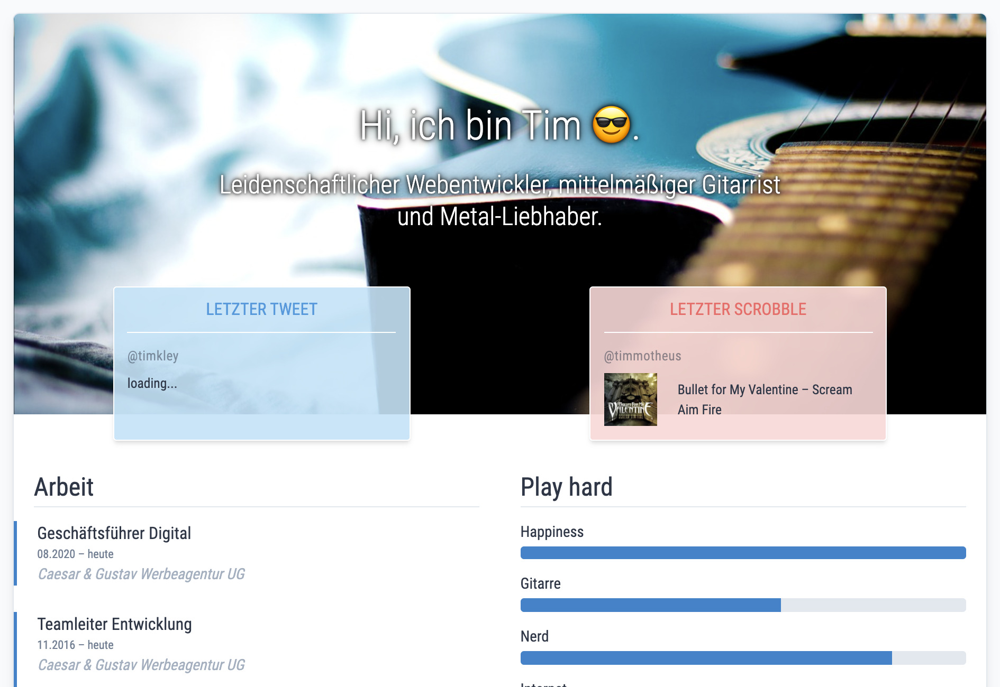

I wanted to create a new version of my website for quite some time. [The old version](https://github.com/timkley/tim-kleyersburg.de/commit/54da506cab1f437faf98c4c87e5c89dd82b99222) was just one site which was also statically generated HTML. I was using `gulp` along with a plugin so I could use [Twig templates](https://twig.symfony.com/doc/2.x/), mainly because I hate to repeat myself in templates, even if it's just a few hundred lines of markup.

I learned the hard way that missing abstraction is the source of many bugs that never should have occurred in the first place. In my early days it was much easier to just copy and paste the (seemingly final) pieces of code, swap out their contents and *be done with it*™.

Jokes on me: I never should have assumed there's such a thing as *being done* when it comes to the web. Everything is subject to change, at any time. Some may call this a curse, to me it's one of the greatest things about the web. Every mistake can be undone, nothing is final. Accepting this premise greatly reduced my anxiety about shipping the perfect thing on the first try.

> Ship early, iterate, improve.

I don't know about you, but I know what *I* did last summer. I wanted to redesign my website and start to write some articles about things I care about.

At first I tried to come up with a solution with my existing setup but couldn't really see how to integrate a blog into my site.

[Source](https://twitter.com/iamdevloper/status/1041999624775626752)
As every good developer I naturally questioned my whole stack. Technology moves fast, especially when it comes to the web. My site was 2 or 3 years old, a Methusalem in web-years (that's kinda like dog years). Frontend tooling moved fast and there where a bunch of options I explored in my head.

Developer experience is important to me. I want to be able to make my own decisions as well as be pampered with relevant features that make my life easier.

This is the section in which I explain why I didn't want to install a CMS. But I can't find the right words right now. I didn't want to use a complex CMS. CMS can be complicated, have too much features I don't need and are a liability along the way.

## Jamstack: the elephant in the room
As an avid reader of [CSS-Tricks](https://css-tricks.com/) the [Jamstack](https://jamstack.org/) was a buzzword I've read a few times before. But it never really sparked my attention. Working mainly with LAMP-Stacks at work because the dynamic component of PHP always was a necessity another "stack" seemed like something that just would waste my limited mental capacity.

But: my personal site didn't need PHP and I had no interest in using PHP for it.

### What is the Jamstack?

Personally, what pushed me in the wrong direction how to think about the Jamstack was the word "stack" itself. It sounded like many parts of some server environment I was unfamiliar with. Which sounded like a lot to learn.

But that's not the case.

> Jamstack is an architecture designed to make the web faster, more secure, and easier to scale.
Source: [jamstack.org](https://jamstack.org)

It's not about Apache, Linux or PHP. It's basically about static HTML being served as fast as possible. And since it's static it can also be served by a CDN from multiple locations with great speed and security.

Writing static HTML sounds like a nightmare if your website contains more than one page. I'd rather have a slower site and don't have to change static HTML for every page of my website. I'd use a server side language like PHP to dynamically create the HTML.

Fortunately we don't have to choose one over the other! One part of Jamstack is "Pre-rendering", meaning you create the complete mark-up before serving it, not in the run-time.

## Static Site Generators – especially Eleventy

This is where Static Site Generators (SSG) come in. One of many SSGs is [Eleventy](https://11ty.dev). I use Eleventy for this very site and it's great. It is all I wanted from my previous setup but so much more mature. It doesn't dictate how I have to structure my website, what CSS framework I should use or what the best base markup is.

Eleventy focusses on your content and not on the layout. Bring Your Own HTML was never so easy. And in the end it'll output static HTML which you can host almost anywhere.

If you are just starting your journey into web programming and are learning HTML and CSS for the first time, also learning about servers, content management systems, databases, and more, you might want to take a look at Eleventy.