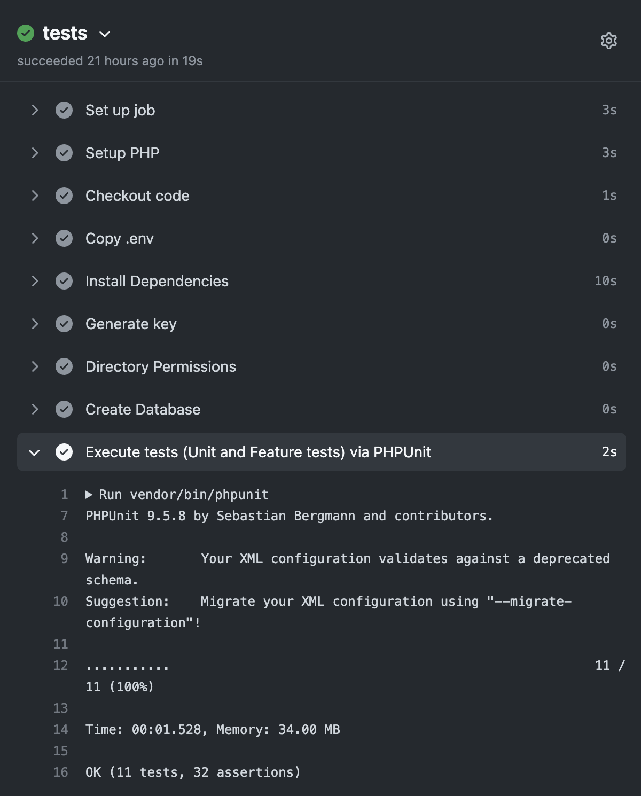
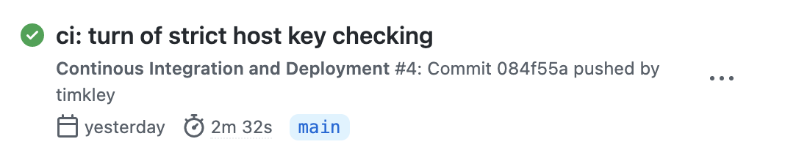

Since years I‘ve been a big fan of GitLab. I started using it because I could host my own private repos without any costs.

I started using GitHub for my own projects in August 2021 with GitHubs announcement of [Codespaces being available for everyone](https://github.blog/changelog/2021-08-11-codespaces-is-generally-available-for-team-and-enterprise/) with a teams plan.

Just hitting `.` in the browser and having a full-blown VS Code instance at my fingertips blew my mind. I really dig GitHubs interface, but if you just want to navigate a project to get a feel for it, I nearly always cloned the repo to my machine so I could use my IDE.
Not anymore.

For work I could see the use of Codespaces as a development environment on demand, so I started playing around with GitHub a lot more.

I knew my way around GitHub, but not from a maintainers point of view.

So the following thoughts are what helped my transition to GitHub and what kept me there.

## User interface
GitHub has done so much in the last years to improve their interface. Compared to GitLab it feels light and much more modern.

The addition that you could click through code to get to function definitions or where a variable was declared made open source projects much more accessible in my opinion.

## Continuous integration / continuous deployment
GitLab had it for years: GitLab CI. I‘ve been using GitLabs shared runners for a few years now and think I got a good grasp at it (at least for my needs).

I set up automatic testing and deployment with it. And after a few months of iterating I now have a set of in good shape `.gitlab-ci.yml` files I can always reference.

I didn‘t want to loose this functionality, so with the rising of GitHub Workflows I was curious to see how challenging the setup on GitHub would be.

Spoiler: It wasn‘t challenging at all.

Maybe my needs aren’t that special or hard to solve. But the ease of setting up, for example, automatic testing for a Laravel application really impressed me. Where I tried to get it working for hours on GitLab, keeping countless tutorials and StackOverflow threads open in other tabs, I could find a ready to use [GitHub Action in the Marketplace](https://github.com/marketplace/actions/laravel-tests).



For deployment I currently use [Deployer](https://deployer.org). Of course there was [an action available](https://github.com/marketplace/actions/action-deployer-php).

As with GitLab I struggled getting access to my repo. In this case, as last time, I got the following error:

```
  Host key verification failed.                                                
  fatal: Could not read from remote repository.                                

  Please make sure you have the correct access rights                          
  and the repository exists.  
```

I don't like the presentation of this error message. The last part about making sure to having the correct access rights is very misleading if you miss the first part.

In my `deploy.php`  I had already set `StrictHostKeyChecking` as SSH option [like described in the docs](https://deployer.org/docs/6.x/hosts) but to no luck.

After logging into the host and running a `git` command my `known_hosts` file was correctly updated and the next automatic deployment with my configured GitHub Action:



To be fair: I learned a lot about CI pipelines in general in the last years, so maybe this comparison isn’t that fair.

But this emphasises one main advantage of GitHub: the community and open source approach in general.