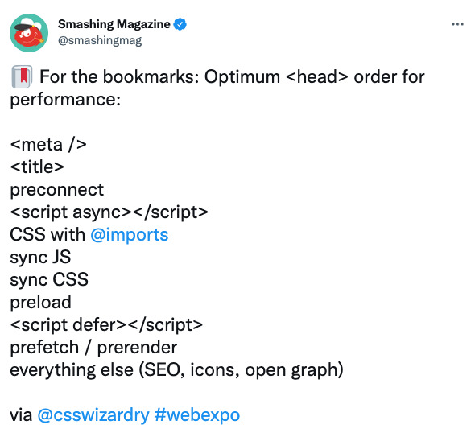

With the [introduction of Web Vitals](https://blog.chromium.org/2020/05/introducing-web-vitals-essential-metrics.html) by Google in May 2020, almost everyone
has probably heard of or got in touch with web performance. Either because you are a developer looking at and developing against these new metrics or because you do
client work and every client waved their bad Google performance report in your face.

## What has changed?

It's not like performance reports didn't exist prior to May 2020. Chances are, you also used [PageSpeed Insights](https://pagespeed.web.dev/) back in the day to
generate reports. The metrics used back then were technical and in many cases very straightforward to optimise. Basically the reports told you what to do very clearly:

> "Your server sent the website to slow, serve it faster!"  
> "These images are too big, make them smaller!"  
> "You only use 50% of the CSS, don't do that."

These are, of course, good suggestions which help to improve your websites performance. But that wasn't enough for Google and shouldn't be enough for you.

Instead of focusing on technical aspects of web performance, Google introduced new metrics that where designed to measure impacts on _user experience_ and _perceived_ performance.

Shortly after the announcement, Google tools like [Lighthouse](https://developers.google.com/web/tools/lighthouse) and PageSpeed Insights (which is based on Lighthouse but more accessible to non-dev people) were updated to reflect these changes, leading to bad performance reports for many websites.

## Why should you care?

You've probably been at the other end of this topic: clicking a link in a search machine and waiting for the page to load.  
When it's finally loaded, you want to click on a link in the first paragraph but realise that the page is still loading. So you wait another second.  
Your next click opens an ad, which popped up just before the paragraph you were reading.

If this happens to me, 9 out of 10 times I'll leave the page and get my information elsewhere.

Another part I want to emphasise, is inclusion. In many cases, developers work with a stable internet connection and good hardware. This prevents them from experiencing what it feels like to use their website on a slow 3G network with a 5 year old device. And this is something the visitors may not be able to change. Take a good look at your target audience so you can make an informed decision about whether or not it is acceptable to have a slow loading website.

Also, the internet consumes a lot of electricity. And your website needs electricity, too. By optimising the performance you make sure to only use what you actually need. Apparently I [should plant a tree](https://www.websitecarbon.com/website/tim-kleyersburg-de/) to accommodate for the CO2 generated by my website (assuming I have 10.000 visitors per month. As if.).

So, unless you _want_ to provide a shitty user experience _and_ destroy the planet, read on.

## So what exactly _is_ performance?

Performance is a very big word and its implications are very broad, even broader since the introduction of Web Vitals, because now bad user experience can cause penalties for your performance rating, too.

So let's break it down into smaller parts to better understand the differences and responsibilities. Take a look at what happens when you request a webpage:

1. You type into the address bar or click a link to e.g., www.tim-kleyersburg.de.
2. The domain name system (DNS) resolves this name to an IP address (the address of a server).
3. The **request** is forwarded to this IP address.
4. Now the server processes your request and does all the work needed so you can see a webpage.
5. After the servers work is done, it sends a **response** back to you. This response contains the HTML of the page you want to look at.
6. Now your browser starts processing this response. It also starts downloading assets (like CSS for styles, JavaScript for interactivity, or images for
   something beautiful to look at).
7. After all this is done you can finally view the webpage in all its glory. 

For simplicity's sake we'll only focus on points 4 to 7.

Typically, everything that happens _before_ your browser receives the response, is called "backend" and everything that happens _after_ is called "frontend" so we'll use these terms to keep it simple.

### Backend (4. and 5.)

Imagine an online store that sells guitars (because I like guitars). You want to take a look at a specific guitar so you click on the link to get to the product page. Now the backend has to do all the work necessary to give you a helpful response. It fetches information about the product from a database, calculates the correct price based on your location and gets stock information for different vendors. All this takes time to compute. This timespan is called "[Time to first byte](https://web.dev/time-to-first-byte/)" or TTFB and is one audit run by Lighthouse to assess your final performance score.

Since all of this computation happens in the "backend", there is no way to extract more information from this measurement without a developer looking into what exactly causes a high TTFB. All these online tools you can use to measure performance, can only tell you "your server took x seconds to send a response". Nothing more.

A good strategy for a good TTFB is to aggressively cache the response and skip the computation part altogether. There are pages which are better suited for this (like this website) than others (like an e-commerce site).  
Rule of thumb: if your content rarely changes and is not personalised (for a logged in user) or parts can change at any time (like a price), a static cache is a great way to achieve a really good TTFB score.

### Frontend (6. and 7.)

Now it gets more complex. Browsers can do a lot more these days so there are more areas that can negatively affect your performance scores.

We'll break it down further to complete the puzzle piece by piece.

_I'm fully aware, there is still a lot more to web performance than the following explanations. Please keep in mind, that the audience for this article are people with a non-tech background._

There are two big parts which very directly affect frontend performance: scripts and assets (like images or videos).

#### Assets

Images can make up a big part of your website. The average website of today [weighs about 2MB](https://httparchive.org/reports/page-weight) and images make up about _half of it_. Let's not take videos into account right now to avoid another layer of complexity.

Since images make up half of your website, it seems natural to care about how they affect the performance of your website. The size of your website has a direct influence on the performance because the more contents need to be loaded, the longer it takes.

#### Scripts

JavaScript (not to be mixed up with Java) is a programming language. It is used for a lot of things concerning websites. It's used to create interactivity, load more content after the initial page has loaded, track visitors, display ads and much more.

Each of these things can have an impact on the performance and therefore affect performance metrics. By executing scripts you are using computing power which can have a negative impact on performance. Fetching content after the first page load can lead to layout shifts and render-blocking scripts can completely halt the rendering of a page, resulting in an unusable page until the script is done.

In commercial sites, there are also most likely a lot of 3rd-party-scripts. **Every script can have a negative impact on performance**, and should therefore be evaluated by you, if this negative impact is worth the potential uplift in other areas.

## How to measure and interpret frontend performance

As outlined above: the tools at our disposal have no way to measure backend performance. There are tools for that, like [Blackfire for PHP](https://www.blackfire.io/), which are, most of the time, focused on developers that care about performance while developing.

### Tools

There are many tools you can use to measure frontend performance. I've used the following which are all well-known and well-used:

[web.dev/measure](https://web.dev/measure/) _by Google_

This tool uses Lighthouse, which is also built into Google Chrome, to run an audit of your webpage. It provides nearly the same output as Chrome but you can do it online in any browser. If you need accurate data (the tests are performed [in a lab environment](https://web.dev/lab-and-field-data-differences/)) use this tool. Because it uses a predefined set of network and device conditions, the results can't fluctuate like a local test or a test with field data (see PageSpeed Insights) can.

[pagespeed.web.dev](https://pagespeed.web.dev/) _by Google_

PageSpeed Insights (PSI) is almost identical to web.dev/measure with one important difference: PSI uses _field data_ provided by Chrome to give you a better understanding of how your website performs for _your actual visitors_. While a lab test can help you enhance your metrics in a reproducible way so you can actually see what works and what doesn't, a test with field data can surface problems your real users are having. Maybe your average user has a much slower network than you do.

[waterfaller.dev](https://waterfaller.dev/)

With waterfaller, you get actionable insight on what and how to improve specific Core Web Vital metrics. It also shows you a waterfall (hence the name) of your requests, this enables you to better understand how and what your website exactly loads when, and how it impacts metrics. What I really liked about using this tool is, that it gives you a clear path to take. Instead of giving you a report with all the things you've done wrong it provides you with help on how to do these things right.

[yellowlab.tools](https://yellowlab.tools/result/g691h5f4kf)

Yellow Lab Tools doesn't analyse Core Web Vitals but a lot other factors that are playing into bad performance, like how many requests you performed, if you have oversized images and more. It's a great addition to the other tools because it can surface quick wins.

[webhint.io](https://webhint.io) _by Microsoft_

webhint can be used as a [browser extension](https://webhint.io/docs/user-guide/extensions/extension-browser/), as CLI using `npx` or [directly in VS Code](https://webhint.io/docs/user-guide/extensions/vscode-webhint/). It not only scans for performance issues but also for things to improve in terms of accessibility, security and more. It is backed up by a lot of documentation which explains what you could and should do. 

----

But what good is the best hammer if you don't know what a nail is. So let's dive deeper into some metrics, focusing again on the Core Web Vitals.

### The metrics

The following metrics where promoted to be much more important for your performance score than they have been before.

**Largest Contentful Paint (LCP)**  
Measures perceived load speed and marks the point in the page load timeline when the page's main content has likely loaded.

Oftentimes this will likely be a hero image of some kind and you can optimise this yourself without talking to your developers.

This metric falls in the "loading" category.

**Time to Interactive (TTI)**  
Time to interactive is the amount of time it takes for the page to become fully interactive. Fully interactive means that the page is displaying useful content, event handlers for most visible page elements are registered and the page responds to user interactions within 50 milliseconds.

For a website to be usable your computer has to do a lot of work. All these things take up time from your CPU and only when these things are finished your page is considered "interactive". Most of the time scripts are responsible for needing much CPU power, so investigate them first.

This metric falls in the "interactivity" category.

**Cumulative Layout Shift (CLS)**  
Measures visual stability and quantifies the amount of unexpected layout shift of visible page content.

Think back to that ad that loads later than the rest of the page, causing the articles paragraph to _shift_ down. But it is not only ads: slow loading images, custom fonts or scripts that load more content can cause layouts to shift unexpectedly.

This metric falls in "visual stability" the category. 

There are a lot more metrics than the ones listed here, but I think these cause the most confusion for a lot of people. If you are interested in learning more about the other metrics you can find them [here](https://web.dev/metrics/).

---- 

## Best practices performance

There are a lot of things you can do for performance. In my daily business I've found that _awareness_ from everyone who works on a project is the most important thing. If you are aware of the problems your changes can cause you'll avoid creating these problems altogether. Instead of remedying an issue you'll prevent it from happening.

So my best advice is: involve the whole team. Always ask "will this affect performance?" and if the answer is "yes" explore how can minimise the negative impact or find a solution that won't impact performance.

Another thing I always advocate is: think mobile first. Mobile devices are used more than desktop devices these days. So creating experiences with the bigger part of the audience in mind not only creates more usable websites, but because performance is that much more important on mobile devices chances are much higher you'll provide a good experience from the start!

But let's take a look at a few actionable insights.

### Images

When optimising images you should take the following things into account:

* 👩‍🎨 **Are my images properly cropped and sized?**
  You don't want to just provide the raw image as it came from Adobe Stock or your camera. Make sure to crop it to only what is needed and has a maximum width
  of your websites viewport.
* 👩‍🎨 **Am I using modern file formats, such as [`webp`](https://caniuse.com/webp) or [`avif`](https://caniuse.com/avif)?**
  Please make sure to provide fallbacks for older browsers before making a complete switch to modern formats.
* 👩‍💻 **Am I taking proper care of serving different images for different devices?**
  Devices with a high-dpi screen need images with more pixels so they appear sharp. But these are much bigger than their average-dpi counterpart and therefore
  take longer to load. You should only load these big images if a high-dpi device is used.

> 👩‍🎨 = designer  
> 👩‍💻 = developer

A designer can take care of generating images in the appropriate sizes and formats while a developer should take care of implementing [responsive images](https://developer.mozilla.org/en-US/docs/Learn/HTML/Multimedia_and_embedding/Responsive_images). There also are systems which can take care of automatically generating appropriately sized images. Most of the time it's easier to manually generate the images needed than to setup a complex automatic process.

### Scripts

> I'll use some of the weak explanations used by performance tools because a deep dive into script performance is definitely not "non-tech". But I'll try to provide actionable insights along the way.

* **Am I only loading scripts I need?**
  When auditing web pages for bad performance many times 3rd party scripts are the culprit for good performance. These script load big libraries like jQuery to perform simple tasks and cause a slow down of your page. Evaluate carefully what scripts you include in your page.
* **Are your own scripts optimised?**
  Everything that applies to 3rd party scripts also applies to your own scripts but with one big advantage: you probably have your scripts under control and can rip out old jQuery dependencies. This is more easily said then done, of course. Give your developers time to evaluate and prepare concepts how to do bigger updates.
* **Are you loading your scripts correctly?**
  There are many ways to trigger the loading of a script file. Some of them are good (because they don't block page rendering for example) and some are not that good (because they _do_ block your page from rendering correctly). If you can, always use the "defer" attribute so the rendering of your page is not blocked.  

  [via @smashingmag](https://twitter.com/smashingmag/status/1440697011985018881?s=27)

## Get your whole team on board

I mentioned awareness to be one of the key factors. If you have to permanently fight against bad performance because not everyone is aware of the problem, you're going to have a bad time.

Educate your team on the importance, what they can do from the start to prevent it, and how to fix existing issues.