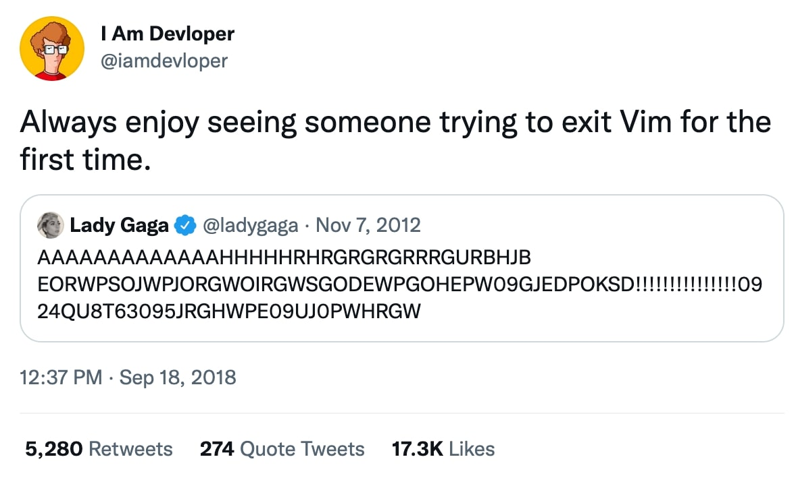

You probably heard of [Vim](https://www.vim.org/). Chances are you probably got stuck in Vim and angrily tried to exit it smashing your mouse and keyboard.

[Source](https://twitter.com/iamdevloper/status/1041999624775626752)

If you got stuck more than once you maybe know by now to exit Vim by typing `:q` (Or `:q!` if you want to be really sure Vim quits).  
Typing a colon tells Vim you want to enter a command (given you are in the so-called „normal mode“, which is the default mode of Vim when it gets started).

But let's cycle back: why would you want to learn Vim, anyway? It‘s complicated and the situations where you really need it are scarce.

For me, it was exactly these situations where you are connected to a remote server over SSH to just make a quick edit to a config. It wasn’t quick or easy at all for me. I always dreaded entering `vim your-site.vhost.conf` because, although knowing how to enter „input mode“, leaving it and quitting Vim, I somehow got stuck 2 out of 3 times anyway.

This frustrated me. But it wasn’t until my brother sat down with me to explain the basics of Vim that I started to get a good grasp of it. I think this is mainly because he explains things to me like I‘m 5 and has unlimited patience when it comes to my understating of things.

This article's aim isn’t to teach you Vim. Countless resources that do a much better job explaining than I could. **I just want to provide you some insights into how learning Vim made me a faster and better developer**.

## Quick introduction to Vim
Know how I said this article won‘t be a tutorial in the last paragraph? Just stay with me for a quick introduction so we all are on the same page (and by writing about it forcing me to get my facts straight and learn some basics in the process).

Vim consists of three modes. Every mode has its own set of features but you will find that using the modes together is what makes Vim so powerful.

### Normal mode
This is the default mode that Vim starts in. If you start typing, unexpected things will happen because *your keys have completely different meanings* in normal mode.
You can use them to navigate (using `h`, `j`, `k` and `l`), enter insert mode (by hitting `i`) or start typing commands by typing `:`. You will see the colon appear in the left bottom corner of the screen.

> The Normal mode is for executing commands (delete words, lines, paragraphs and a lot of others). Basically, it’s to edit your text (or code).
[How did I Replace PhpStorm by Vim in my Heart, Matthieu Cneude](https://thevaluable.dev/phpstorm-vs-vim/)

### Insert mode
This is the mode that after entering it gives you this familiar feeling because you can *just type away* like in your normal editor / IDE. Nothing bad happens when you type, you just see the characters you want happily appearing on the screen. Until you hit `Esc` and fall back to „normal mode“

### Visual mode
The visual mode (which you can get into by hitting `v` from the normal mode) works similarly to normal mode. The key difference is that you are selecting the underlying text/code when moving through the code which gives you the possibility to copy, cut or just delete the selected pieces of code.

### Motions
Although not the perfect synonym you could also call it „movements“. You hit one or more specific keys and get where you want to be. And you get there fast, after some learning.
And one of the most important advantages, which applies to all of Vim: your hands stay on the keyboard much more, therefore reducing the time spent moving your right hand to the mouse, searching for what you want to click on, and getting back to typing.
You maybe think this is negligible if you just look at the time you can spend. It’s the feeling of productivity and efficiency that comes with it, that makes this so compelling to me.

## Why did I want to learn Vim?
Two driving factors pushed me to learn Vim.

One: my frustration not being able to edit a damn config file on a server without the fear of breaking it. Even after years of programming experience.

Second: seeing developers like [Jeffrey Way](https://twitter.com/jeffrey_way) on [Laracasts](https://laracasts.com) or my brother editing code like magic. The most common demeanor was the block cursor you see in Vim's normal mode.

All in all, I had the feeling I was being held back by my not existing knowledge of the tools with which I program. I'd gotten very good at hitting nails with the wrong side of the hammer – and hitting my finger all the time. But I was *fast*. I learned how to type with more than 2 fingers early on, so I was always faster than my colleagues. But never as fast as some of the people I looked up to in my programmer sphere.

## Why is Vim faster?
Being faster can be a motivator to learn Vim. It certainly was for me, after I saw *just how much faster I could be*.  
It’s the little things that let you feel like you are in much more control. Most of the time your mental process is very similar to how Vim works.

An example: I write a lot of HTML, so working with tags is one of those things I need to do all the time. Selecting the whole tag, changing the content inside a paragraph tag, or just deleting the `
` alltogether.

This is more or less was this process looks like with or without Vim.

*Normal Editor*
1. Go to tag
2. Select all of its content with the mouse or keyboard (be careful not the select one of the start or end braces `</>`), fucking up your whole markup in the process.
3. Finally change it.

*Vim*
1. Place cursor somewhere in the tag while in normal mode
2. Type `cit`
3. Boom💥

`cit`  means **c**hange **i**nner **t**ag. I use it all the time.

The above process doesn’t look so much different on paper, but I would argue the Vim way is 5 times faster than the other way. Maybe 10 times if you use your mouse to select what you want to change.

<video class="w-full" autoplay loop muted src="this-is-the-way.mp4"></video>
[via GIPHY](https://giphy.com/gifs/disneyplus-star-wars-the-mandalorian-madalorian-Ld77zD3fF3Run8olIt)

## How I got into Vim and got better with it
After my crash course, I installed/activated Vim mode in all my editors (I use PHPStorm and VSCode) and just force myself to use it. After the first week (in which I felt very unproductive) I got used to it and quickly got back to the speed I had before.
It clicked the first time I changed a file on a remote server. I felt so comfortable! And I was quick compared to before. This experience was what kept me going.

I took another lesson from my brother. He showed me some more advanced motions and commands. But I plateaued quickly. Don't get me wrong: I still got faster from day to day because I got used to it. Where I had to think in the beginning to hit the correct keys I now mainly use my muscle memory.

### Resources
Afar from the personal conversations with my brother, where I could also ask questions, get another explanation the following resources helped me a lot to better understand Vim, see how other people use it and what their learning process looked like.

*Vim Mastery by Jeffrey Way on laracasts.com*
[Link](https://laracasts.com/series/vim-mastery) paid
I always recommend Jeffrey and Laracasts. Laracasts started as a video learning platform for Laravel but also has many great series about everything around programming.
Vim Mastery is a great course.

*Vim for Beginners by Matthieu Cneude*
[Link](https://thevaluable.dev/vim-beginner/) free
This is a complete series not only for beginners but also advanced or expert users.
In my opinion, Matthieu has a great mindset when it comes to how to use the tools at your hand, how to customize them to suit your needs and get the most out of them.

## Final words
If you now feel like you could also level up your skills: just do it! Activate Vim mode in VSCode or whatever editor you use /and just start/! It's easier than you think and very rewarding in its own way.

Matthieue Phrasen it perfectly in his [Vim for Beginners](https://thevaluable.dev/vim-beginner/) article:

> To me, Vim is the gamification of coding.

It really is. Like in a game you need to learn when to push the right buttons to get the outcome you want. It is a lot of fun after the first few steps because you feel how you are progressing.

I hope you give Vim a chance!
